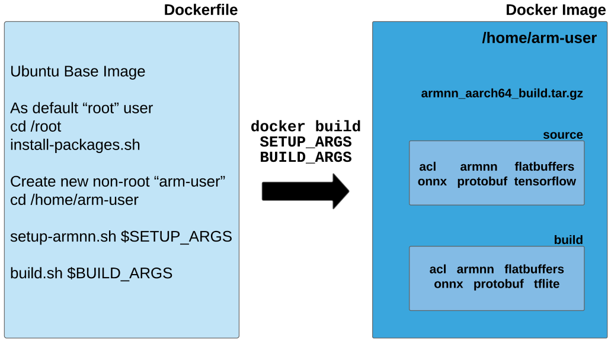

# Arm NN Build Tool
The **_Arm NN Build Tool_** provides a collection of **parameterized bash scripts** accompanied by a **Dockerfile** for building Arm NN and its dependencies, including **[Arm Compute Library (ACL)](https://github.com/ARM-software/ComputeLibrary/)**.
This tool replaces/supersedes the majority of the existing Arm NN build guides as a user-friendly way to build Arm NN from scratch.
The main benefit of building Arm NN from scratch is the ability to **exactly choose which components to build, targeted for your ML project**.<br>
The Arm NN Build Tool is tested on **x86_64 (Intel) and aarch64 (Arm) build hosts** for the **Ubuntu** platform.
Other host platforms such as Windows and Mac **should** work (with Docker installed), but have not been officially tested.<br>
At present, the tool supports **targeting Linux devices (from Ubuntu 18.04 onwards) on x86_64 and aarch64** architectures.<br>
We recommend using the Arm NN Build Tool through the use of Docker. However, the scripts may be [executed directly on your machine](#build-arm-nn-without-docker) if desired.

**If you already have Docker installed** and want to quickly build the Arm NN Dockerfile with some default build arguments, please follow the [Docker Build Steps](#docker-build-steps).

* [Overview](#overview)
* [System Requirements](#system-requirements)
* [Install Docker](#install-docker)
  * [Ubuntu / Linux](#ubuntu--linux)
  * [Windows and Mac](#windows-and-mac)
* [Docker Build Arguments Reference](#docker-build-arguments-reference)
  * [SETUP_ARGS](#setup_args)
  * [BUILD_ARGS](#build_args)
* [Docker Build Steps](#docker-build-steps)
* [Build Arm NN Without Docker](#build-arm-nn-without-docker)
* [Advanced Usage](#advanced-usage)
  * [Use custom Arm NN and ACL repository versions during build](#use-custom-arm-nn-and-acl-repository-versions-during-build)
  * [Additional Docker Build Arguments](#additional-docker-build-arguments)
  * [Inspect the contents of the Docker Image](#inspect-the-contents-of-the-docker-image)
  * [Bind Mounts](#bind-mounts)

## Overview
The Arm NN Build Tool consists of an official Arm NN **Dockerfile** with associated **scripts** for building Arm NN:
1. **```install-packages.sh```:** builds CMake from source and installs system-wide **apt packages**
2. **```setup-armnn.sh```:** downloads and builds Arm NN **dependencies** (e.g. Flatbuffers, TF Lite, Protobuf)
3. **```build-armnn.sh```:** builds Arm NN and ACL
4. **```common.sh```:** common variables and functions used by ```setup-armnn.sh``` and ```build-armnn.sh```
5. **```validation.sh```:** validation of common command-line arguments to ```setup-armnn.sh``` and ```build-armnn.sh```
6. **```docker-copy-to-host```:** helpful script to copy contents of a Docker Image to the host machine

A **Dockerfile** is a text document which outlines the instructions for building a **Docker Image**. Running ```docker build```
on the Arm NN Dockerfile will result in a Docker Image that contains:
1. The Ubuntu operating system
2. Installed system-wide packages required by Arm NN
3. Source code for Arm NN and its dependencies
4. The build for Arm NN and its dependencies

All scripts except ```docker-copy-to-host.sh``` are used during the ```docker build``` process.

The ```docker-copy-to-host.sh``` script creates a temporary [**Docker Container**](https://www.docker.com/resources/what-container/) which is required to retrieve files from the
Docker Image. A Docker Container is a **runtime** version of a Docker Image. It can be interacted with through a command-line
terminal, like a lightweight virtual machine (VM). The ```docker-copy-to-host.sh``` script is designed to run on the host
machine after ```docker build``` to copy the Arm NN build to the host.

The **diagram below** outlines the operation of the Arm NN **Dockerfile** and the contents of the resulting **Docker Image** after
running ```docker build```. During ```docker build```, the provided **```SETUP_ARGS```** determine which of Arm NN's
dependencies to download and build. The **```BUILD_ARGS```** Docker argument determines which components of Arm NN to build.

The resulting Docker Image contains the Arm NN build (along with everything required to build it) in the home directory ```/home/arm-user```.
There are two directories: **```source```** which contains the source code of Arm NN and its dependencies, and **```build```**
which contains the Arm NN build and the builds of each dependency of Arm NN.

The **```armnn_aarch64_build.tar.gz``` tarball** in the home directory is a compressed archive of the Arm NN build which is located at ```/home/arm-user/build/armnn```.
The home directory also contains the **scripts** mentioned above (not pictured in the diagram), which are copied into the
Docker Image during the ```docker build``` process.

<div align="center">
  
</div>

<br>

**Benefits of using Docker:**
1. Run one ```docker build``` command instead of executing multiple scripts, saving developer time
2. Can easily manage multiple different build configurations at once, each in their own Docker Image
3. System packages are installed in the Docker Image only, isolated from the host machine
4. Build in the exact environment the Arm NN Team used during testing, ensuring consistency in builds
5. Allows Arm NN to be built on a wide range of hosts, as long as they support Docker

**Disadvantages of using Docker:**
1. Requires the developer to install Docker on their host machine
2. Requires the developer to get familiar with Docker (this guide should help)
3. Possible incompatibilities/limitations if the host machine's Linux Kernel version is too different than that of the
base OS in the Docker Image. This is due to the fact that Docker Containers share the Linux Kernel of the host machine
(unlike VM's which each have their own Kernel).

<br>

## System Requirements
This guide will not provide the system requirements for installing Docker - please refer to the Docker documentation during installation.

The built Docker Image has disk requirements of **less than 6GB**, depending on the Arm NN components chosen and whether
the build included a cross compile (i.e. building aarch64 on x86_64). Repeated builds may cause the total disk usage to increase
beyond 6GB. The ```docker images``` command shows the disk usage of each Docker Image. To view total disk space used by all
Docker Images and Docker Containers, use the command ```docker system df```.

This Dockerfile was built on a **Ubuntu 18.04 host machine with Docker version 20.10.14**. We recommend using a host machine
with at least Ubuntu 18.04 and a similar Docker version, if possible. Other Linux distros such as **Debian** should also work as
long as the Docker version is similar to **20.10.14**.

The build outputs from this Dockerfile have been tested on an **Odroid N2+ target device with Ubuntu 18.04** installed. The build outputs
should also work on newer versions of Ubuntu (and Debian) but this has not been exhaustively tested.

To view the system packages that are installed during ```docker build```, please refer to the ```install-packages.sh``` script.

<br>

## Install Docker
Builds of the official Arm NN Dockerfile have been tested on the **Ubuntu 18.04** host platform.
Whilst other platforms have not been tested, Docker should be able to build the Arm NN Dockerfile on other platforms such as Windows and Mac.
On **Linux**, we recommend using **Docker Engine** which is used through the command-line interface (CLI).
For **Windows and Mac** users, **Docker Desktop** is available which allows the use of the CLI plus a graphical interface.<br>
This guide will **only** provide steps on using Docker through the use of the CLI and not Docker Desktop.

### Ubuntu / Linux
For Ubuntu users, we recommend installing **Docker Engine** with the following steps from the Docker documentation:<br>
1. [Uninstall any old versions of Docker](https://docs.docker.com/engine/install/ubuntu/#uninstall-old-versions)
2. [Install using the repository](https://docs.docker.com/engine/install/ubuntu/#install-using-the-repository)
3. [Add user to Docker Unix Group](https://docs.docker.com/engine/install/linux-postinstall/#manage-docker-as-a-non-root-user) (**recommended**: allows running of Docker commands **without ```sudo```**)

Similar steps for installing Docker Engine on other Linux distributions can be found by clicking on your distro under the Server table on [this page](https://docs.docker.com/engine/install/#server).

### Windows and Mac
We do not officially test the building of the Arm NN Dockerfile on Windows or Mac. However, it's likely that it will work if your system supports Docker.
For **Windows**, use the Docker Desktop download link on [this page](https://docs.docker.com/desktop/install/windows-install/).
For **Mac** users, please use the Docker Desktop download link on [this page](https://docs.docker.com/desktop/install/mac-install/). <br>
**Note:** we unfortunately cannot provide support for the installation of Docker and/or the use of the Arm NN Dockerfile on Windows and Mac platforms.

<br>

## Docker Build Arguments Reference
The following describes the ```docker build``` arguments that can be used to customize the Arm NN build.
Docker build arguments such as ```SETUP_ARGS``` and ```BUILD_ARGS``` are provided in the ```docker build``` as a ```--build-arg```.

### SETUP_ARGS
These arguments are eventually passed to ```setup-armnn.sh``` which downloads and builds Arm NN dependencies.
For ease of use (but longer initial docker build), use ```--all``` to have all Arm NN dependencies available for use during Arm NN builds.
Repeated docker builds with the same ```SETUP_ARGS``` will skip the setup process (using [caching](https://docs.docker.com/develop/develop-images/dockerfile_best-practices/#leverage-build-cache) of previous Docker build steps).
The ```SETUP_ARGS``` string should start and end with **double quotes** ```"```.

| SETUP_ARGS        | Description                                                                      |
|-------------------|:---------------------------------------------------------------------------------|
| --tflite-delegate | **flag:** setup dependencies for the Arm NN TF Lite Delegate                     |
| --tflite-parser   | **flag:** setup dependencies for the Arm NN TF Lite Parser                       |
| --onnx-parser     | **flag:** setup dependencies for the Arm NN ONNX parser                          |
| --all             | **flag:** setup dependencies for all Arm NN components listed above              |
| --target-arch=    | **mandatory option:** specify a target architecture ```aarch64, x86_64```        |

**At least one component** (e.g. ```--tflite-delegate```) must be provided **or** else provide ```--all``` to setup dependencies for all components.

**Examples:**<br>
Setup for aarch64 with all Arm NN dependencies:<br>
```SETUP_ARGS="--target-arch=aarch64 --all"```

Setup for aarch64 with TF Lite Delegate and TF Lite Parser dependencies only:<br>
```SETUP_ARGS="--target-arch=aarch64 --tflite-delegate --tflite-parser"```

<br>

### BUILD_ARGS
The following arguments are given to ```build-armnn.sh``` and define which components of Arm NN to include in the build.
The ```BUILD_ARGS``` string should start and end with **double quotes** ```"```.

| BUILD_ARGS          | Description                                                                                                                                                                                                                                                                                                           |
|---------------------|:----------------------------------------------------------------------------------------------------------------------------------------------------------------------------------------------------------------------------------------------------------------------------------------------------------------------|
| --tflite-delegate   | **flag:** build the Arm NN TF Lite Delegate component                                                                                                                                                                                                                                                                 |
| --tflite-parser     | **flag:** build the Arm NN TF Lite Parser component                                                                                                                                                                                                                                                                   |
| --onnx-parser       | **flag:** build the Arm NN ONNX parser component                                                                                                                                                                                                                                                                      |
| --all               | **flag:** build all Arm NN components listed above                                                                                                                                                                                                                                                                    |
| --target-arch=      | **mandatory option:** specify a target architecture ```aarch64, x86_64```                                                                                                                                                                                                                                             |
| --neon-backend      | **flag:** build Arm NN with the NEON backend (CPU acceleration from ACL)                                                                                                                                                                                                                                              |
| --cl-backend        | **flag:** build Arm NN with the OpenCL backend (GPU acceleration from ACL)                                                                                                                                                                                                                                            |
| --ref-backend       | **flag:** build Arm NN with the reference backend<br/>**Should be used for verification purposes only.<br/>Does not provide any performance acceleration.**                                                                                                                                                           |
| --debug             | **flag:** build Arm NN (and ACL) with debug turned on (optional: defaults to off)                                                                                                                                                                                                                                     |
| --armnn-cmake-args= | **option:** provide additional comma-separated CMake arguments string for building Arm NN (optional)<br/>String should start and end with **single quotes** ```'```<br/>Please refer to **armnn/cmake/GlobalConfig.cmake**                                                                                            |
| --acl-scons-params= | **option**: provide additional comma-separated scons parameters string for building ACL (optional)<br/>String should start and end with **single quotes** ```'```<br/>ACL provide [documentation](https://arm-software.github.io/ComputeLibrary/latest/how_to_build.xhtml#S1_1_build_options) for their build options |


**At least one component** (i.e. ```--tflite-delegate```, ```--tflite-parser```, ```--onnx-parser```) must be provided or else provide ```--all``` to build all Arm NN components.<br>
**A component given in ```BUILD_ARGS``` must also have been given in ```SETUP_ARGS``` previously**, or else Arm NN will fail to build.<br>
**At least one backend** (i.e. ```--neon-backend```, ```--cl-backend```, ```--ref-backend```) must be chosen.<br>

**Examples:**<br>
Build for aarch64 with all Arm NN components, NEON enabled and OpenCL enabled:<br>
```BUILD_ARGS="--target-arch=aarch64 --all --neon-backend --cl-backend"```

Build for aarch64 with TF Lite Delegate, OpenCL enabled and additional ACL scons params:<br>
```BUILD_ARGS="--target-arch=aarch64 --tflite-delegate --cl-backend --acl-scons-params='compress_kernels=1,benchmark_examples=1'"```

Setup for aarch64 with all Arm NN dependencies, OpenCL enabled and additional Arm NN cmake args:<br>
```BUILD_ARGS="--target-arch=aarch64 --all --cl-backend --armnn-cmake-args='-DBUILD_SAMPLE_APP=1,-DBUILD_UNIT_TESTS=0'"```

**Example _valid_ combination of SETUP_ARGS and BUILD_ARGS:**<br>
```
SETUP_ARGS="--target-arch=aarch64 --all"
BUILD_ARGS="--target-arch=aarch64 --tflite-delegate --neon-backend --cl-backend"
```

**Example _invalid_ combination of SETUP_ARGS and BUILD_ARGS:**<br>
```
SETUP_ARGS="--target-arch=aarch64 --tflite-delegate"
BUILD_ARGS="--target-arch=aarch64 --all --neon-backend --cl-backend"
```

The example above is invalid since it tries to build all Arm NN components after **only** building the dependencies required by the TF Lite Delegate.

<br>

## Docker Build Steps

First clone the Arm NN repo to obtain the build-tool. This automatically downloads the latest release version of Arm NN.
```
git clone https://github.com/ARM-software/armnn.git armnn
```
<br>

Enter into the Arm NN build-tool directory where the Dockerfile and associated scripts are located.
```
cd armnn/build-tool
```
<br>

Run the ```docker build```, which downloads and builds Arm NN and its dependencies. This process is isolated from the host machine's filesystem and the result is a Docker Image being created.<br>
Dockerfile arguments are provided using ```--build-arg```, the relative path to the Dockerfile is given with ```--file``` and the current directory is given with ```.```<br>
Provide a descriptive name for the Image with ```--tag``` in the form of ```image_name:tag``` (example given below). The backslashes ```\``` tell Bash to expect a continuation of the command on the next line.

This example's choice of **[SETUP_ARGS](#setup_args)** and **[BUILD_ARGS](#build_args)** builds all Arm NN components with NEON and OpenCL accelerated backends for aarch64 target.
This process should take **less than an hour** with a modern machine but will vary depending on the arguments chosen and host machine specification.

```
docker build \
--build-arg SETUP_ARGS="--target-arch=aarch64 --all" \
--build-arg BUILD_ARGS="--target-arch=aarch64 --all --neon-backend --cl-backend" \
--tag armnn:aarch64 \
--file docker/Dockerfile .
```

<br>

Arm NN and all of its dependencies are now built within a Docker Image. Built Docker images can be listed with ```docker images```.
```
docker images

REPOSITORY   TAG       IMAGE ID       CREATED          SIZE
armnn        aarch64   cc623174fd98   7 seconds ago    5.02GB
```

<br>

A tarball archive of the Arm NN build is located inside the Docker home directory (```/home/arm-user/```), named ```armnn_<target-arch>_build.tar.gz```.
If the ```--debug``` build flag is provided in the ```BUILD_ARGS``` above, the tarball will be named ```armnn_<target-arch>_build_debug.tar.gz```.<br>
The ```docker-copy-to-host.sh``` script will copy a file from the Docker Image (in arm-user's home directory) to the host machine.<br>
The script copies the tarball into a new directory on the host in ```build-tool/docker_output```. It takes two arguments: ```image_name:tag``` and ```filename```.<br>
The filename is a relative path from the home directory created inside the Docker Image (```/home/arm-user/```).
```
./scripts/docker-copy-to-host.sh armnn:aarch64 armnn_aarch64_build.tar.gz
```

<br>

This tarball can now be used for integration in an ML application. The method of extraction is given below.<br>
If the ```--target-arch``` chosen in the arguments above matches the host machine, the build can be tested locally (else copy the tarball to a remote device).
```
cd docker_output

# Extract the tarball into a directory called <target_arch>_build
# If --debug is enabled, the extracted build directory will be called <target_arch>_build_debug
tar -xzf armnn_aarch64_build.tar.gz
cd aarch64_build

# Set LD_LIBRARY_PATH to the current aarch64_build directory (.)
export LD_LIBRARY_PATH=.; ./UnitTests

# If the Arm NN TF Lite Delegate is built, we can also run DelegateUnitTests
cd delegate

# Set LD_LIBRARY_PATH to the current delegate directory (.) and the aarch64_build directory (..)
export LD_LIBRARY_PATH=.:..; ./DelegateUnitTests
```

<br>

**Note:** Repeated Docker builds may result in an accumulation of unwanted, dangling images. **To remove dangling images** (good practice), run the following command: ```docker image prune```

<br>

## Build Arm NN without Docker
For ease of use, we recommend that the official Arm NN Dockerfile is used to build Arm NN.
If you'd like to build locally on a Ubuntu host machine without Docker, execute the build-tool scripts directly instead.
This involves running ```install-packages.sh``` followed by ```setup-armnn.sh``` and ```build-armnn.sh```.
The arguments for ```setup-armnn.sh``` and ```build-armnn.sh``` are very much the same as ```SETUP_ARGS``` and ```BUILD_ARGS```.
Please use ```--help``` for more specific information.

```
cd build-tool/scripts

sudo ./install-packages.sh

./setup-armnn.sh --target-arch=aarch64 --all
./build-armnn.sh --target-arch=aarch64 --all --neon-backend --cl-backend

./setup-armnn.sh --help
./build-armnn.sh --help
```

<br>

## Advanced Usage

### Use custom Arm NN and ACL repository versions during build
By default, the docker build process (specifically, during ```build-armnn.sh```) will download the latest release versions of Arm NN and ACL.
If you'd like to use different versions during the build, check them out in the ```build-tool``` directory on the host.<br>
When providing custom repositories, the following ```docker build``` argument must be provided ```--build-arg BUILD_TYPE=dev```.
This will trigger Docker to copy the custom repos into the Docker Image during build. The ACL repo is only required if
supplying the ```--neon-backend``` or ```--cl-backend``` BUILD_ARGS options.

**Note:** the Arm NN version used for build-tool (Dockerfile and scripts) is not the same version of Arm NN that is used during the build.
This means that separate versions of Arm NN can be used for the build-tool and for building Arm NN itself.<br>
If you repeat the ```docker build``` process multiple times (e.g. with different ```BUILD_ARGS```), the setup process will be skipped as long as ```SETUP_ARGS``` remains the same.
```
cd build-tool

git clone https://github.com/ARM-software/armnn.git armnn
cd armnn
git checkout <branch or SHA>

cd ..

# custom ACL repo only required when supplying --neon-backend or --cl-backend BUILD_ARGS options
git clone https://github.com/ARM-software/ComputeLibrary.git acl
cd acl
git checkout <tag or SHA>

cd ..

# Example docker build with BUILD_TYPE=dev, ran inside the build-tool directory
docker build \
--build-arg BUILD_TYPE=dev \
--build-arg SETUP_ARGS="--target-arch=aarch64 --all" \
--build-arg BUILD_ARGS="--target-arch=aarch64 --all --neon-backend --cl-backend" \
--tag armnn:aarch64 \
--file docker/Dockerfile .
```

<br>

### Additional Docker Build Arguments

#### UBUNTU_VERSION
The default base Image used during ```docker build``` is ```ubuntu:18.04```. Building Arm NN with this default image should be sufficient for a wide range of target devices.
To use a different Ubuntu base Image, provide ```UBUNTU_VERSION``` during ```docker build``` e.g. ```--build-arg UBUNTU_VERSION=20.04```.

#### BUILD_TYPE
By default, ```BUILD_TYPE``` is set to ```production```. This means that the latest release versions of Arm NN and ACL are used during builds.
To use custom repositories as explained [above](#Use-custom-Arm-NN-and-ACL-repository-versions-during-build), provide ```--build-arg BUILD_TYPE=dev```.

#### Additional SETUP_ARGS and BUILD_ARGS
The following are additional ```SETUP_ARGS``` and ```BUILD_ARGS``` that can be provided to the ```docker build```.

| SETUP_ARGS / BUILD_ARGS | Description                                                                                                                                                          |
|-------------------------|:---------------------------------------------------------------------------------------------------------------------------------------------------------------------|
| --num-threads=          | **option:** specify number of threads/cores to build Arm NN and its dependencies with (this defaults to number of online cores on the host)<br/>e.g. --num-threads=4 |
| -x                      | **flag:** enable shell tracing during setup-armnn.sh and build-armnn.sh script execution                                                                             |

#### USER_ID and GROUP_ID
By default, the Docker Image creates a user called ```arm-user``` with user/group ID of 1000. This ensures the build outputs can be used by a wide range of users on target devices.<br>
To provide a more specific user and group ID to be associated with the build, provide ```--build-arg USER_ID=XXXX``` and ```--build-arg GROUP_ID=YYYY```.

<br>

### Inspect the contents of the Docker Image
To inspect the full contents of the Docker Image, the Image must be run as a **Docker Container**.
A Container is a runtime version of the Image, like a **lightweight virtual machine** with its own filesystem.

The following shows how to run a container with an interactive terminal based on a specified Docker Image ```image_name:tag```.
The ID of the generated container in this example is ```4da7c575a95a```. An ```ls``` command shows the contents of the ```/home/arm-user``` directory.
```
docker run --interactive --tty armnn:aarch64

arm-user@4da7c575a95a:~$ ls
armnn_aarch64_build.tar.gz  build  build-armnn.sh  common.sh  setup-armnn.sh  source  validation.sh
```
The ```source``` directory contains the downloaded dependencies for building Arm NN.<br>
The ```build``` directory contains the built Arm NN dependencies and the Arm NN build itself.<br>
The ```armnn_aarch64_build.tar.gz``` tarball is an archive of the build located at ```build/armnn/aarch64_build```.<br>
The scripts (e.g. ```build-armnn.sh```) in this directory can be run as you wish, changes will persist within the container but not the Docker Image.
To exit the docker container, run ```CTRL-D```. A list of Docker containers can be obtained with the following command:
```
# --all shows both running and non-running containers
docker ps --all

CONTAINER ID   IMAGE           COMMAND    CREATED          STATUS                     PORTS    NAMES
4da7c575a95a   armnn:aarch64   "bash"     7 minutes ago    Exited (0) 7 seconds ago            pedantic_joliot
```
To restart the same container (and any changes made to it) in a terminal again, use the following commands:
```
# 4da7c575a95a in this case is the CONTAINER ID from above

docker start 4da7c575a95a # restart container in background
docker attach 4da7c575a95a # re-attach to terminal

# After exiting with CTRL-D
docker stop 4da7c575a95a
```
To save space over time, stopped Docker containers can be deleted with the following command:<br>
```docker container prune```.

<br>

### Bind Mounts
**Bind Mounts** may be used to mount directories from the host machine to inside a Docker container. This could be useful when
frequently changing the contents of the Arm NN or ACL source repositories (in ```/home/arm-user/source```) between runs of
build-armnn.sh inside the container. Note that bind mounts are a feature that apply to runtime versions of Docker
images i.e. Docker Containers (```docker run```, not ```docker build```).
Please refer to the [Docker documentation for more information about bind mounts](https://docs.docker.com/storage/bind-mounts/).