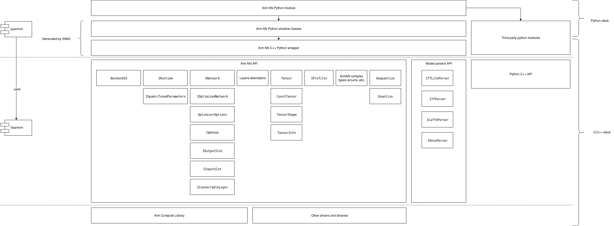

# PyArmNN

PyArmNN is a python extension for [Arm NN SDK](https://developer.arm.com/ip-products/processors/machine-learning/arm-nn).
PyArmNN provides interface similar to Arm NN C++ Api.
Before you proceed with the project setup, you will need to checkout and build a corresponding Arm NN version.

PyArmNN is built around public headers from the armnn/include folder of Arm NN. PyArmNN does not implement any computation kernels itself, all operations are
delegated to the Arm NN library.

The [SWIG](http://www.swig.org/) project is used to generate the Arm NN python shadow classes and C wrapper.

The following diagram shows the conceptual architecture of this library:


# Setup development environment

Before, proceeding to the next steps, make sure that:

1. You have Python 3.6+ installed system-side. The package is not compatible with older Python versions.
2. You have python3.6-dev installed system-side. This contains header files needed to build PyArmNN extension module.
3. In case you build Python from sources manually, make sure that the following libraries are installed and available in you system:
``python3.6-dev build-essential checkinstall libreadline-gplv2-dev libncursesw5-dev libssl-dev libsqlite3-dev tk-dev libgdbm-dev libc6-dev libbz2-dev``
4. Install SWIG 4.x. Only 3.x version is typically available in Linux package managers, so you will have to build it and install it from sources. It can be downloaded from the [SWIG project website](http://www.swig.org/download.html) or from [SWIG GitHub](https://github.com/swig/swig). To install it follow the guide on [SWIG GitHub](https://github.com/swig/swig/wiki/Getting-Started).

## Setup virtual environment

Now you can proceed with setting up workspace. It is recommended to create a python virtual environment, so you do not pollute your working folder:
```bash
python -m venv env
source env/bin/activate
```

You may run into missing python modules such as *wheel*. Make sure to install those using pip:
```bash
pip install wheel
```

## Build python distr

Python supports source and binary distribution packages.

Source distr contains setup.py script that is executed on the users machine during package installation.
When preparing binary distr (wheel), setup.py is executed on the build machine and the resulting package contains only the result
of the build (generated files and resources, test results etc).

In our case, PyArmNN depends on Arm NN installation. Thus, binary distr will be linked with
the local build machine libraries and runtime.

The recommended way to build the python packages is by CMake.

### CMake build

The recommended approach is to build PyArmNN together with Arm NN by adding the following options to your CMake command:
```
-DBUILD_PYTHON_SRC=1
```
This will build the source package. Current project headers and build libraries will be used, so there is no need to provide them.

SWIG is required to generate the wrappers. If CMake did not find the executable during the configure step or it has found an older version, you may provide it manually:
```
-DSWIG_EXECUTABLE=<path_to_swig_executable>
```

After the build finishes, you will find the python packages in `<build_folder>/python/pyarmnn/dist`.

# PyArmNN installation

PyArmNN can be distributed as a source package or a binary package (wheel).

Binary package is platform dependent, the name of the package will indicate the platform it was built for, e.g.:

* Linux x86 64bit machine: pyarmnn-32.0.0-cp36-cp36m-*linux_x86_64*.whl
* Linux Aarch 64 bit machine: pyarmnn-32.0.0-cp36-cp36m-*linux_aarch64*.whl

The source package is platform independent but installation involves compilation of Arm NN python extension. You will need to have g++ compatible with C++ 14 standard and a python development library installed on the build machine.

Both of them, source and binary package, require the Arm NN library to be present on the target/build machine.

It is strongly suggested to work within a python virtual environment. The further steps assume that the virtual environment was created and activated before running PyArmNN installation commands.

PyArmNN also depends on the NumPy python library. It will be automatically downloaded and installed alongside PyArmNN. If your machine does not have access to Python pip repositories you might need to install NumPy in advance by following public instructions: https://scipy.org/install.html

## Installing from source package

Installing from source is the most reliable way.

While installing from sources, you have the freedom of choosing Arm NN libraries location. Set environment variables *ARMNN_LIB* and *ARMNN_INCLUDE* to point to Arm NN libraries and headers.
If you want to use system default locations, just set *ARMNN_INCLUDE* to point to Arm NN headers.
Additionally, *LD_LIBRARY_PATH* may need to be updated to the Arm NN libraries location due to dependencies of the same shared library files being 'not found'.

```bash
$ export  ARMNN_LIB=/path/to/libs
$ export  LD_LIBRARY_PATH=$LD_LIBRARY_PATH:/path/to/libs
$ export  ARMNN_INCLUDE=/full/path/to/armnn/include:/full/path/to/armnn/profiling/common/include
```

Install PyArmNN as follows:
```bash
$ pip install /path/to/armnn/python/pyarmnn
```

If PyArmNN installation script fails to find Arm NN libraries it will raise an error like this

`RuntimeError: ArmNN library was not found in ('/usr/lib/gcc/aarch64-linux-gnu/8/', <...> ,'/lib/', '/usr/lib/'). Please install ArmNN to one of the standard locations or set correct ARMNN_INCLUDE and ARMNN_LIB env variables.`

You can now verify that PyArmNN library is installed and check PyArmNN version using:
```bash
$ pip show pyarmnn
```
You can also verify it by running the following and getting output similar to below:
```bash
$ python -c "import pyarmnn as ann;print(ann.GetVersion())"
'32.0.0'
```


## Installing PyArmNN while using ArmNN prebuilt binaries

If you wish to use ArmNN prebuilt binaries from our release page, you will need to generate the PyArmNN SWIG wrappers.

Again setup your environmental variables along with a virtual environment:

```bash
$ python -m venv env
$ source env/bin/activate

$ export  ARMNN_LIB=/path/to/libs
$ export  LD_LIBRARY_PATH=$LD_LIBRARY_PATH:/path/to/libs
$ export  ARMNN_INCLUDE=/full/path/to/armnn/include:/full/path/to/armnn/profiling/common/include
```

Then generate the SWIG wrappers:
```bash
$ cd armnn/python/pyarmnn/
$ python swig_generate.py -v
```

Then install PyArmNN:
```bash
# From directory armnn/python/pyarmnn/
$ pip install .
```

As above, you can verify that PyArmNN library is installed and check PyArmNN version using:
```bash
$ pip show pyarmnn
```
You can also verify it by running the following and getting output similar to below:
```bash
$ python -c "import pyarmnn as ann;print(ann.GetVersion())"
'32.0.0'
```

# PyArmNN API overview

#### Getting started
The easiest way to begin using PyArmNN is by using the Parsers. We will demonstrate how to use them below:

Create a parser object and load your model file.
```python
import pyarmnn as ann
import imageio

# An ONNX parser also exists.
parser = ann.ITfLiteParser()
network = parser.CreateNetworkFromBinaryFile('./model.tflite')
```

Get the input binding information by using the name of the input layer.
```python
input_binding_info = parser.GetNetworkInputBindingInfo(0, 'model/input')

# Create a runtime object that will perform inference.
options = ann.CreationOptions()
runtime = ann.IRuntime(options)
```
Choose preferred backends for execution and optimize the network.
```python
# Backend choices earlier in the list have higher preference.
preferredBackends = [ann.BackendId('CpuAcc'), ann.BackendId('CpuRef')]
opt_network, messages = ann.Optimize(network, preferredBackends, runtime.GetDeviceSpec(), ann.OptimizerOptions())

# Load the optimized network into the runtime.
net_id, _ = runtime.LoadNetwork(opt_network)
```
Make workload tensors using input and output binding information.
```python
# Load an image and create an inputTensor for inference.
img = imageio.imread('./image.png')
input_tensors = ann.make_input_tensors([input_binding_info], [img])

# Get output binding information for an output layer by using the layer name.
output_binding_info = parser.GetNetworkOutputBindingInfo(0, 'model/output')
output_tensors = ann.make_output_tensors([output_binding_info])
```

Perform inference and get the results back into a numpy array.
```python
runtime.EnqueueWorkload(0, input_tensors, output_tensors)

results = ann.workload_tensors_to_ndarray(output_tensors)
print(results)
```

#### Examples

To further explore PyArmNN API there are several examples provided in the `/examples` folder for you to explore.

##### Image Classification

This sample application performs image classification on an image and outputs the <i>Top N</i> results, listing the classes and probabilities associated with the classified image. All resources are downloaded during execution, so if you do not have access to the internet, you may need to download these manually.

Sample scripts are provided for performing image classification with TFLite and ONNX models with `tflite_mobilenetv1_quantized.py` and `onnx_mobilenetv2.py`.

##### Object Detection

This sample application guides the user and shows how to perform object detection using PyArmNN API. By taking a model and video file or camera feed as input, and running inference on each frame, we are able to interpret the output to draw bounding boxes around detected objects and overlay the corresponding labels and confidence scores.

Sample scripts are provided for performing object detection from video file and video stream with `run_video_file.py` and `run_video_stream.py`.


## Tox for automation

To make things easier *tox* is available for automating individual tasks or running multiple commands at once such as generating wrappers, running unit tests using multiple python versions or generating documentation. To run it use:

```bash
$ tox <task_name>
```

See *tox.ini* for the list of tasks. You may also modify it for your own purposes. To dive deeper into tox read through https://tox.readthedocs.io/en/latest/

## Running unit-tests

Download resources required to run unit tests by executing the script in the scripts folder:

```
$ python ./scripts/download_test_resources.py
```

The script will download an archive from the Linaro server and extract it. A folder `test/testdata/shared` will be created. Execute `pytest` from the project root dir:
```bash
$ python -m pytest test/ -v
```
or run tox which will do both:
```bash
$ tox
```
